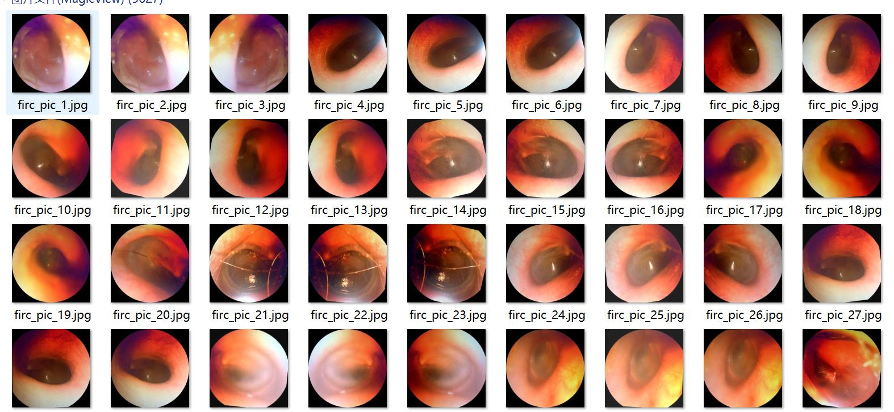

# Voice of the Clinics with Enhanced Infrared Imaging for Ear Disease Detection in VOC+YOLO Format: 5627 Images in 10 Classes with Enhanced Annotations

Pay attention to the dataset, more than half of it is enhanced images. The main enhancement method is noise enhancement. Please see the image for details.
Dataset format: Pascal VOC format + YOLO format (without segmentation path's txtfile, only contains jpgimage and corresponding VOC format xmlfile and yolo format txtfile).
number of images: 5627  
annotation count: 5627  
annotation count: 5627  
annotationnumber of classes: 10  
Annotation class names (notice the format in YOLO is different from this, but follow the order of labels file with classes.txt): ["ergou", "ertongqiguan", "gumoyinghua", "gushiyinghua", "jiamo", "jixingzhongeryan", "manxinghuanongxingzhongeryan", "manxingzhongeryan", "yiwu"]
"zhongeryan"]  
1. Epidemore
2. Eustachian tube
3. Otosclerosis
4. Otitis media
5. Foreign body
6. Acute otitis media
7. Chronic purulent otitis media
8. Chronic otitis media
9. Foreign body
10. Otitis media
boxes per class:   
ergou box count = 1891  
"ertongqiguan box count = 39" is a Chinese sentence translated to English. Here is the translation:

"The number of boxes in the 'ertongqiguan' frame = 39"
Gumoyinghua Frame Count = 99
Gushiyinghua Frames = 66
jiamo box count = 28  
jixingzhongeryan box count = 3264  
manxinghuanongxingzhongeryan box count = 1284  
manxingzhongeryan box count = 2916  
yiwu = 7
"zhongeryan box count = 90" is a Chinese sentence. Here are the English translations:

- "zhongeryan" translates to "Zhongeryan" in English.
- "Frame count" translates to "frame count" in English.
- "= 90" translates to "=" followed by "90" in English.
Total number of frames: 9684
Number of images per category:
ergou images = 1858  
ertongqiguan images = 39  
Gumoyinghua's possession of images = 99
Gu Shi Yinghua has 66 pictures.
jiamo images = 28  
The number of images owned by Jixing Zhongeryan is 1624.
manxinghuanongxingzhongeryan images = 174  
manxingzhongeryan images = 1642  
yiwu images = 7  
zhongeryan images = 90  
Resolution: 640x640
Use annotation tool: labelImg  
Annotation rule: draw a rectangular box for class.
Important note: The dataset does not have separate training, validation, and test sets.
Special Disclaimer: This dataset does not guarantee the accuracy of the trained model or the weight files.
Image preview:
## Images

Here is a pay link on Stripe ( https://buy.stripe.com/3cs8yP7sY87d0vu9AB ). Please contact me lonlonago@foxmail.com after funding $89, and I will send you a complete data files , thank you!

